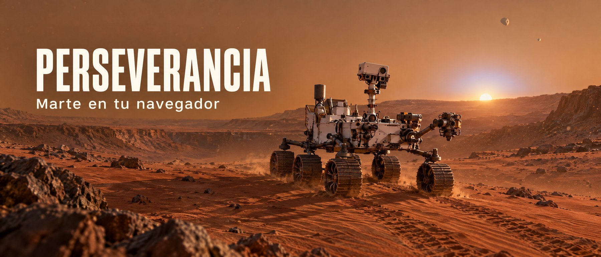
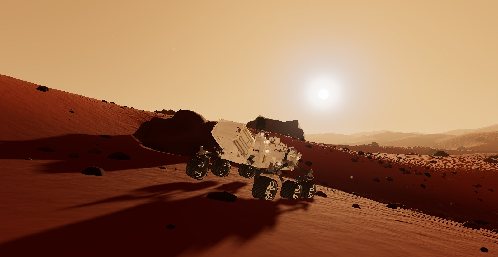
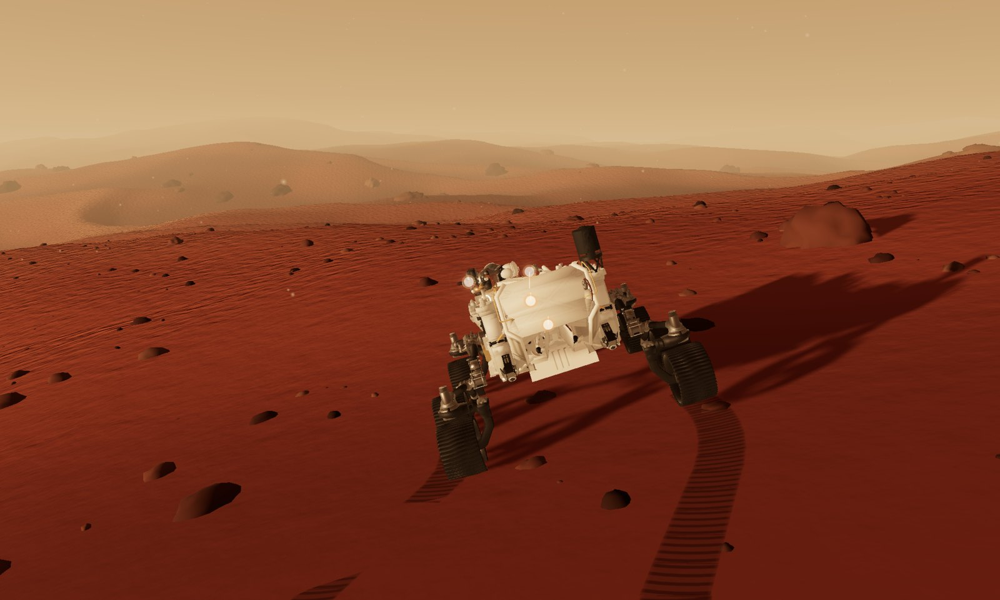
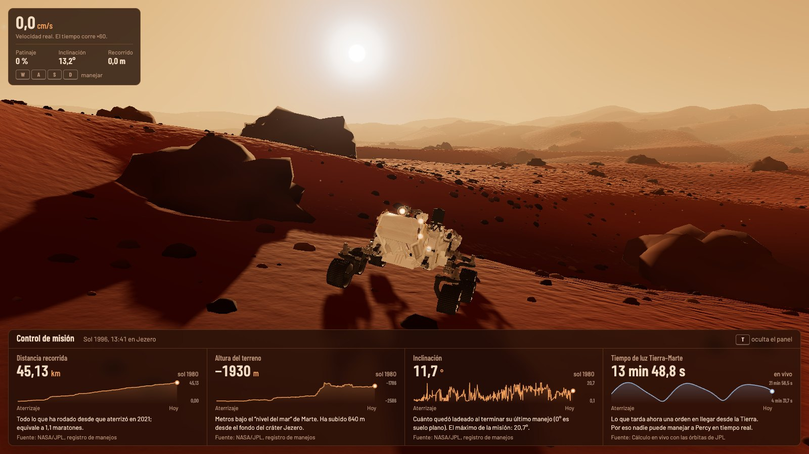
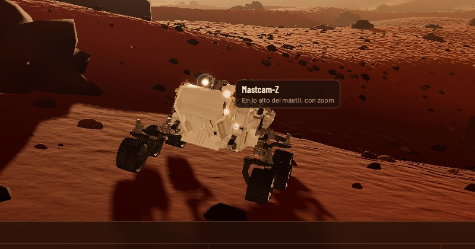
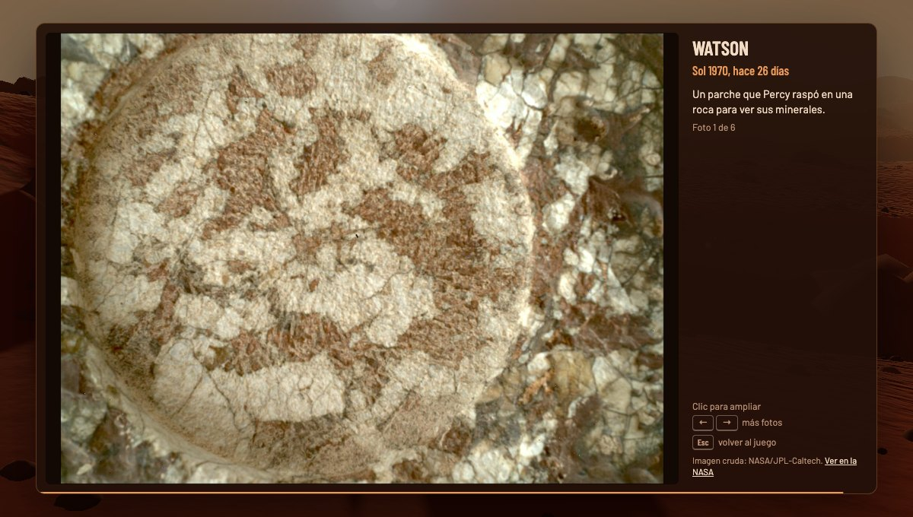
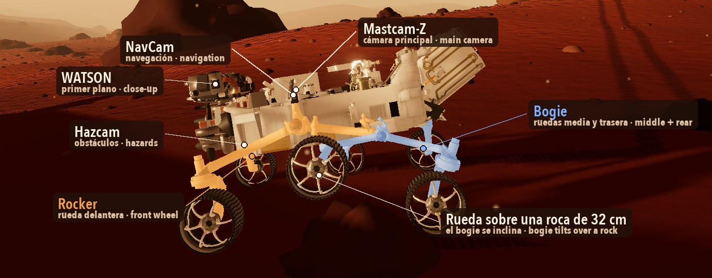
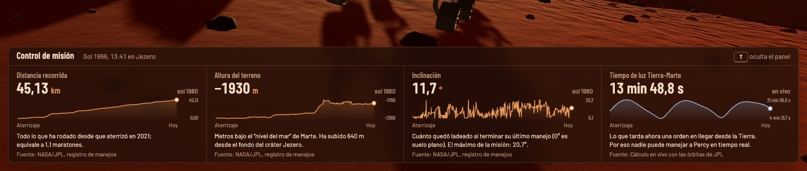
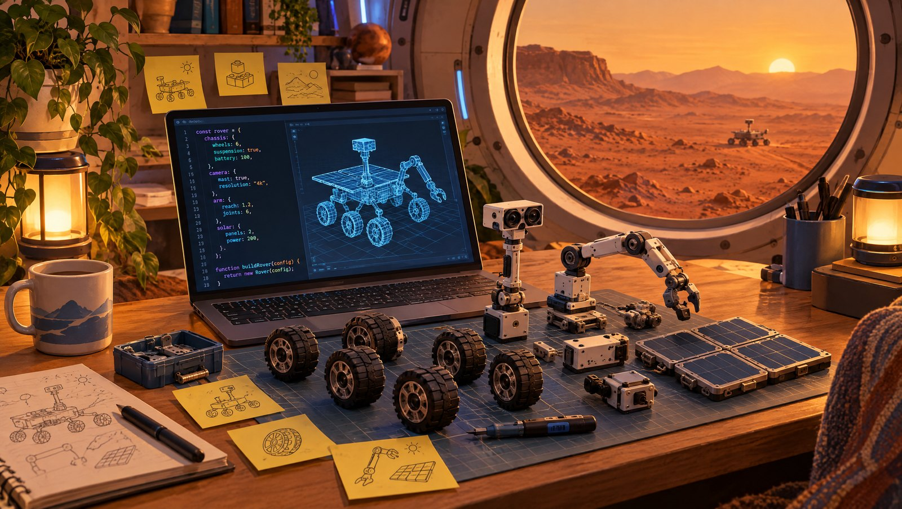
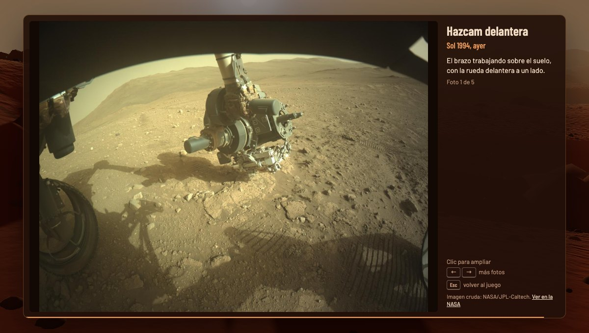

<p align="center">
  
</p>

<p align="center">
  <b>Español</b> · <a href="#english">English</a>
</p>

# Perseverancia

**Maneja el rover Perseverance de la NASA por Marte, desde tu navegador.**

Es una simulación 3D hecha con [Three.js](https://threejs.org) que mezcla un juego con datos de verdad: el rover se mueve con la mecánica del Perseverance real, el control de misión muestra datos reales de la NASA y sus cámaras abren fotos reales que Percy tomó en Marte en los últimos días.

<p align="center">
  
</p>

## Qué puedes hacer

|  |  |
|---|---|
|  | **Manejar el rover.** Las seis ruedas giran, las cuatro de las esquinas se orientan y la suspensión *rocker-bogie* sube rocas de hasta 52,5 cm. En arena empinada patina, como le pasa al real. |
|  | **Ver el control de misión.** Distancia recorrida, altura del terreno e inclinación del registro de manejos de la NASA, y el tiempo que tarda la luz entre la Tierra y Marte, calculado en vivo. |
|  | **Usar las cámaras de Percy.** Mastcam-Z, NavCam, Hazcam y WATSON brillan sobre el modelo. Haz clic en una y la foto llega línea a línea, como baja desde Marte. |
|  | **Mirar fotos reales.** Cada foto dice qué cámara la tomó, en qué sol y hace cuántos días. Usa las flechas para ver más y Esc para volver al juego. |

## Pruébalo en 2 minutos

Necesitas [Node.js](https://nodejs.org) 20 o superior.

```bash
git clone https://github.com/Feloguarin/perseverancia.git
cd perseverancia
npm install
npm run dev
```

Abre <http://localhost:5173> y listo.

| Tecla | Qué hace |
|---|---|
| <kbd>W</kbd> <kbd>S</kbd> | Avanzar y retroceder |
| <kbd>A</kbd> <kbd>D</kbd> | Girar (solas: gira sobre sí mismo; con W: en arco) |
| <kbd>T</kbd> | Mostrar u ocultar el control de misión |
| Mouse | Mover la cámara alrededor del rover |
| Clic en un punto brillante | Tomar una foto con esa cámara |
| <kbd>←</kbd> <kbd>→</kbd> / <kbd>Esc</kbd> | Más fotos / volver al juego |

## Cómo funciona, en simple

<p align="center">
  
</p>

- **El terreno** se genera con ruido matemático: dunas, colinas y rocas, siempre iguales en cada carga.
- **El rover** usa la suspensión *rocker-bogie* del real. El *rocker* (ámbar) sostiene la rueda delantera; el *bogie* (azul), la del medio y la trasera. Así, cuando una rueda sube a una roca, las otras cinco siguen en el suelo y el cuerpo apenas se inclina.
- **La velocidad es real**: 4,2 cm/s. Como eso sería muy lento para jugar, el reloj del rover corre 60 veces más rápido, y el tablero lo dice.
- **El control de misión** usa el patrón de telemetría de [Open MCT](https://nasa.github.io/openmct/), la herramienta de la NASA: cada dato tiene nombre, unidad y un proveedor que sabe traer su historial.
- **Las fotos** se escogieron a mano entre ~2.600 imágenes crudas de los últimos soles, buscando que se sienta Marte: horizontes, el brazo sobre el suelo y rocas de cerca.

## Datos reales que usa

<p align="center">
  
</p>

| Dato | De dónde sale |
|---|---|
| Distancia, altura e inclinación | [Registro de manejos de Perseverance](https://mars.nasa.gov/mmgis-maps/M20/Layers/json/M20_waypoints.json) (NASA/JPL) |
| Tiempo de luz Tierra–Marte | Calculado en vivo con los elementos orbitales de JPL |
| Fotos | [API de imágenes crudas de Mars 2020](https://mars.nasa.gov/mars2020/multimedia/raw-images/) (NASA/JPL-Caltech) |

## Cómo está organizado

```
src/
  main.js          arma la escena y el ciclo del juego
  terrain.js       dunas y colinas
  rocks.js         rocas
  sky.js           cielo marciano, con el halo azul del atardecer
  rover.js         física de movilidad: dirección, patinaje, rocker-bogie
  roverRig.js      separa el modelo 3D en piezas móviles
  ground.js        rocas sólidas que el rover puede subir o no
  mission/         control de misión (patrón de Open MCT)
  cameras/         cámaras de Percy, visor y fotos escogidas
scripts/check.mjs  prueba automática con capturas
```

## Construye encima

<p align="center">
  
</p>

Este proyecto es una base. Tómalo, cámbialo y hazlo tuyo. Algunas ideas:

- **Control con retraso real:** manda órdenes al rover y que lleguen con los 3 a 22 minutos que tarda la luz. Así se maneja el de verdad.
- **Manejo autónomo:** que el rover esquive rocas solo usando sus Hazcams, como hace el sistema AutoNav.
- **El helicóptero Ingenuity** volando sobre el cráter.
- **La ruta real:** dibujar en un mapa los 45 km que Percy ha manejado, con el mismo registro de la NASA.
- **Fotos siempre nuevas:** un script que proponga fotos recientes para revisar.
- **Mástil y brazo animados**, tormentas de polvo, día y noche, sonido de Marte.
- **Modo celular** con controles táctiles.

Para contribuir:

1. Haz un *fork* y crea una rama.
2. Corre `npm run check` antes de abrir tu PR: abre el juego en Chrome sin ventana, prueba la física, los datos y las cámaras, y guarda capturas en `screenshots/`.
3. Abre un *pull request* contando qué hiciste. Si no sabes por dónde empezar, abre un *issue* y lo pensamos juntos.

## Créditos

- Datos y fotos: NASA/JPL-Caltech y ASU (Mastcam-Z). Fotos crudas, sin procesar.
- El banner y la ilustración de "Construye encima" fueron generados con IA. Las demás imágenes son capturas reales del juego.
- Este es un proyecto de la comunidad, **no está afiliado a la NASA**.
- Código bajo [licencia MIT](LICENSE).

---

<a id="english"></a>

<p align="center">
  <a href="#perseverancia">Español</a> · <b>English</b>
</p>

# Perseverancia (English)

**Drive NASA's Perseverance rover across Mars, right in your browser.**

A 3D simulation built with [Three.js](https://threejs.org) that blends a game with real data: the rover moves with the mechanics of the real Perseverance, mission control shows real NASA data, and its cameras open real photos Percy took on Mars in the last few days.

## What you can do

- **Drive the rover.** All six wheels spin, the four corner wheels steer, and the *rocker-bogie* suspension climbs rocks up to 52.5 cm. On steep sand it slips, just like the real one.
- **Check mission control.** Distance driven, terrain elevation and tilt from NASA's drive log, plus the Earth–Mars light time, computed live.
- **Use Percy's cameras.** Mastcam-Z, NavCam, Hazcam and WATSON glow on the model. Click one and the photo arrives line by line, as if downlinked from Mars.
- **Browse real photos.** Each one shows the camera, the sol and how many days ago it was taken. Use the arrows for more and Esc to get back to the game.

<p align="center">
  
</p>

## Try it in 2 minutes

You need [Node.js](https://nodejs.org) 20 or newer.

```bash
git clone https://github.com/Feloguarin/perseverancia.git
cd perseverancia
npm install
npm run dev
```

Open <http://localhost:5173> and you're in.

| Key | What it does |
|---|---|
| <kbd>W</kbd> <kbd>S</kbd> | Drive forward and backward |
| <kbd>A</kbd> <kbd>D</kbd> | Turn (alone: turn in place; with W: drive an arc) |
| <kbd>T</kbd> | Show or hide mission control |
| Mouse | Orbit the camera around the rover |
| Click a glowing dot | Take a photo with that camera |
| <kbd>←</kbd> <kbd>→</kbd> / <kbd>Esc</kbd> | More photos / back to the game |

## How it works, simply

- **The terrain** is generated with math noise: dunes, hills and rocks, the same on every load.
- **The rover** uses the real *rocker-bogie* suspension. The *rocker* (amber in the diagram above) holds the front wheel; the *bogie* (blue) holds the middle and rear wheels. When one wheel climbs a rock, the other five stay on the ground and the body barely tilts.
- **Speed is real**: 4.2 cm/s. That would be too slow to play, so the rover's clock runs 60× faster, and the dashboard says so.
- **Mission control** follows the telemetry pattern of [Open MCT](https://nasa.github.io/openmct/), NASA's mission control framework: every value has a name, a unit and a provider that knows how to fetch its history.
- **The photos** were hand-picked from ~2,600 raw images from the latest sols, looking for what feels like Mars: horizons, the arm above the ground, close-up rocks.

## Real data it uses

| Data | Source |
|---|---|
| Distance, elevation and tilt | [Perseverance drive log](https://mars.nasa.gov/mmgis-maps/M20/Layers/json/M20_waypoints.json) (NASA/JPL) |
| Earth–Mars light time | Computed live from JPL orbital elements |
| Photos | [Mars 2020 raw images API](https://mars.nasa.gov/mars2020/multimedia/raw-images/) (NASA/JPL-Caltech) |

## Build on top of it

This project is a starting point. Take it, change it, make it yours. Some ideas:

- **Real-delay driving:** send commands that arrive after the 3–22 minutes light takes to reach Mars. That's how the real rover is driven.
- **Autonomous driving:** let the rover avoid rocks on its own using its Hazcams, like the AutoNav system.
- **The Ingenuity helicopter** flying over the crater.
- **The real route:** map the 45 km Percy has driven, using the same NASA log.
- **Always-fresh photos:** a script that suggests recent photos to review.
- **Animated mast and arm**, dust storms, day and night, Martian sound.
- **Mobile mode** with touch controls.

To contribute:

1. Fork the repo and create a branch.
2. Run `npm run check` before opening your PR: it opens the game in headless Chrome, tests the physics, data and cameras, and saves screenshots to `screenshots/`.
3. Open a pull request describing what you did. Not sure where to start? Open an issue and let's figure it out together.

## Credits

- Data and photos: NASA/JPL-Caltech and ASU (Mastcam-Z). Raw, unprocessed images.
- The banner and the "Build on top" illustration were generated with AI. All other images are real screenshots of the game.
- This is a community project, **not affiliated with NASA**.
- Code under the [MIT license](LICENSE).
